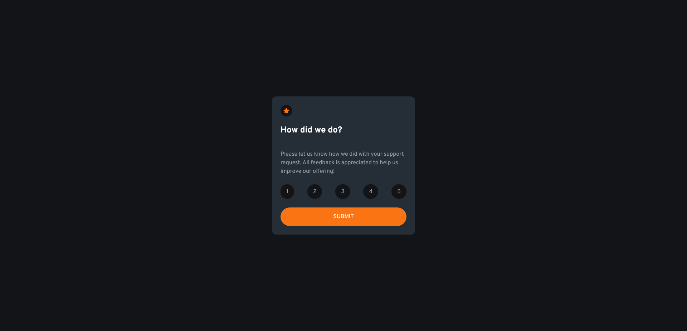
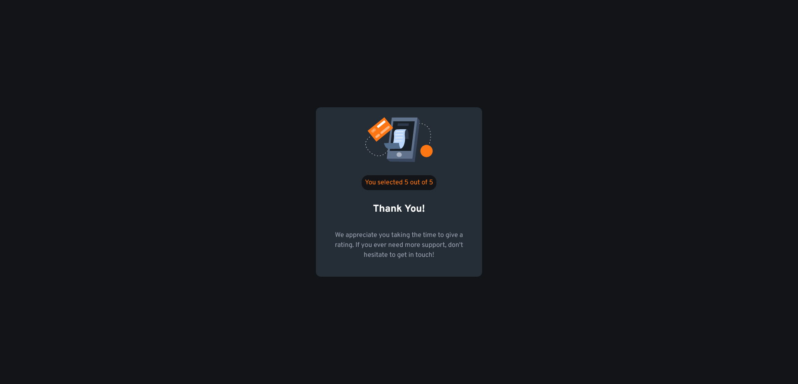

# Frontend Mentor - Interactive rating component solution

This is a solution to the [Interactive rating component challenge on Frontend Mentor](https://www.frontendmentor.io/challenges/interactive-rating-component-koxpeBUmI). Frontend Mentor challenges help you improve your coding skills by building realistic projects. 

## Table of contents

- [Overview](#overview)
  - [The challenge](#the-challenge)
  - [Screenshot](#screenshot)
  - [Links](#links)
- [My process](#my-process)
  - [Built with](#built-with)
  - [What I learned](#what-i-learned)
  - [Continued development](#continued-development)
- [Author](#author)

## Overview

### The challenge

Users should be able to:

- View the optimal layout for the app depending on their device's screen size
- See hover states for all interactive elements on the page
- Select and submit a number rating
- See the "Thank you" card state after submitting a rating

### Screenshot




### Links

- Solution URL: [Github](https://github.com/Sengsith/react-interactive-rating-component)
- Live Site URL: [Netlify](https://sengsith-interactive-rating-component.netlify.app)

## My process

My work process in order was work on CSS custom properties, HTML, reactJS including using react-router-dom, and finish up with the general styling using node-sass.

### Built with

- Semantic HTML5 markup
- CSS custom properties
- Flexbox
- Mobile-first workflow
- [React](https://reactjs.org/) - JS library
- [react-router-dom](https://github.com/remix-run/react-router#readme) - Routing library
- [node-sass](https://github.com/sass/node-sass) - CSS preprocessor

### What I learned

My major learning throughout this project was figuring out how to transfer data using react-router-dom. At it's simplest layer, I used react-router-dom to navigate through different pages but, I have never tried to transfer data between each other until working on this project.

First, don't forget to wrap our App component with BrowserRouter to allow us to use react-router-dom:

```js
  <BrowserRouter>
    <App />
  </BrowserRouter>
```

Then, set up our routes component and create each individual route desired:
```js
  <Routes>
    <Route path="/" element={<Rating />} />
    <Route path="/submit" element={<Submit />} />
  </Routes>
```

To SEND data to another link, we an object using "state": 
```js
  <Link to="/submit" state={{rating: rating}} style={{textDecoration: 'none', color: 'white'}}>
    <button type="submit">SUBMIT</button>
  </Link>
```

To USE the data received from another component, we have to use "location":

```js
  const location = useLocation();
  ...
  <h1>You selected {location.state.rating} out of 5</h1>
```

### Continued development

The most challenging part about this project was moreso the CSS aspect. I had troubles figuring out which colors correspond to which section, so I just adjusted to what I felt looked the best. I also may need to figure out where the best spot would be to put my main tag when working with react as it seems there could be multiple places to put it, while also achieving the same result.

## Author

- Frontend Mentor - [@Sengsith](https://www.frontendmentor.io/profile/Sengsith)